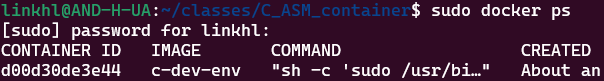

# C_ASM_container

Bienvenido al curso de **Tecnologías e Infraestructura de Cómputo**.

En este repositorio encontrará el ambiente de desarrollo contenerizado con un compilador de C/ASM en arquitectura de 32 bits que puede ser usado para el primer módulo del curso. 
Este entorno le permitirá replicar y ejecutar **localmente (en su propia máquina)** el mismo ambiente de desarrollo que se usó durante el primer laboratorio, garantizando así la compatibilidad y uniformidad en las prácticas. 

Para utilizarlo es necesario tener instaladas las siguientes herramientas:

- Docker 🐳 

En el caso de contar con un computador windows, recomendamos utilizar Docker sobre WSL2. 

## Nota importante

Los archivos que usted cree dentro de este ambiente de desarrollo se almacenarán dentro del contenedor. Siempre mantenga una copia de respaldo (backup) en otro ambiente; ya sea en el sistema de archivos de su máquina o en onedrive. **Es su responsabilidad mantener una copia de respaldo para evitar inconvenientes.**

## Despliegue y uso del contenedor

### Despliegue

Para desplegar el contenedor (después de tener docker instalado) debe:

1. Clone este repositorio en su computadora.
2. En su terminal, dirijase al directorio donde clonó el repositorio (puede utilizar el comando cd \<rutaRepositorio\> para este fin).
3. Construir la imagen de docker, debe cambiar el parámetro \<SuContraseña\> por la contraseña de su preferencia para acceder al ambiente de desarrollo:

    ```bash
    docker build --build-arg PASSWORD=<SuContraseña> -t c-dev-env .
    ```

    Este proceso puede tardar algunos minutos mientras se descargan las dependencias necesarias para el contenedor. Sea paciente mientras se realiza la instalación.

4. Instanciar el contenedor

    ```bash
    docker run -d -p 8080:8080 -p 2222:22 c-dev-env
    ```
### Uso en interfaz web

Dirijase a su navegador de preferencia y podrá utilizar el ambiente de desarrollo en la siguiente url http://localhost:8080

Para ingresar a la interfaz web debe utilizar la contraseña que definio durante la construcción del contenedor (parámetro \<SuContraseña\>).

### Uso con VS code local

Ahora podrá conectarse al servidor de VS code del contenedor de la misma forma usada en el primer laboratorio, pero cambiando la IP por ```localhost``` y el puerto a ```2222```. La contraseña de acceso es la definio durante la construcción del contenedor (parámetro \<SuContraseña\>).
Si requiere más detalles sobre la conexión puede revisar [la guía del laboratorio](https://github.com/Cursos-Infraestructura-Uniandes/C_ASM_container/wiki/Preparar-conexi%C3%B3n-a-ambiente-de-desarrollo). 

## Al finalizar

Una vez haya terminado de trabajar, detenga la ejecución del contenedor para liberar recursos. 

1. Liste los contenedores activos con: 
    ```bash
    docker ps
    ```
2. Localice el ID del contenedor correspondiente (puede identificarlo por el tag asignado a la imagen, en el ejemplo ```c-dev-env```).
    

3. Deténgalo con: 
    ```bash
    docker kill <ID>
    ```
